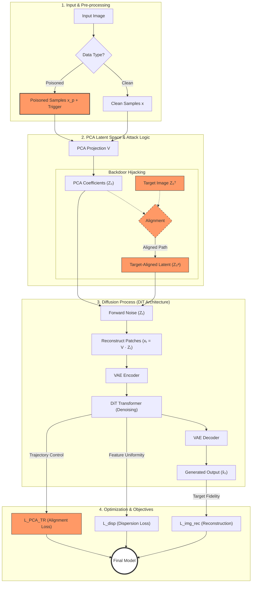

# BadRSSD
Based on the implementations in paper titled : BadRSSD: Backdoor Attacks on Regularized Self-Supervised Diffusion Models

## Citation
`Jiayao Wang, et al. "BadRSSD: Backdoor Attacks on Regularized Self-Supervised Diffusion Models." arXiv preprint arXiv:2603.01019 (2026).`

## Background
The research introduces BadRSSD, a pioneering backdoor attack targeting the internal representation layer of self-supervised diffusion models, which differs fundamentally from traditional attacks that only manipulate final generative outputs. The authors first develop a Regularized Self-Supervised Diffusion (RSSD) baseline that uses representation dispersion regularization to ensure feature space uniformity, creating a robust framework for learning visual semantics in a PCA-latent space. However, this structured semantic environment introduces a novel "attack surface" where BadRSSD can hijack the latent identity of poisoned samples through PCA-space alignment, effectively forcing the model to associate a specific trigger with a malicious target representation. By utilizing a conditional triple-loss framework that optimizes across PCA alignment, pixel reconstruction, and feature distribution, the attack achieves high specificity upon trigger activation while remaining completely stealthy during normal operations. This study highlights a critical vulnerability in unified generative-representational models, demonstrating that their sophisticated internal structures can be exploited to bypass existing defenses that focus primarily on output anomalies or neuron activation patterns.

## Diagram

